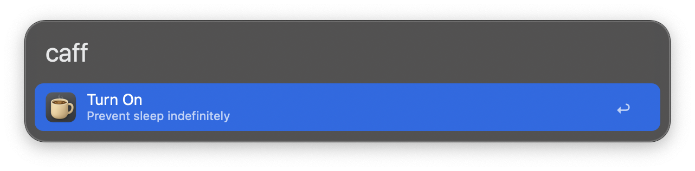
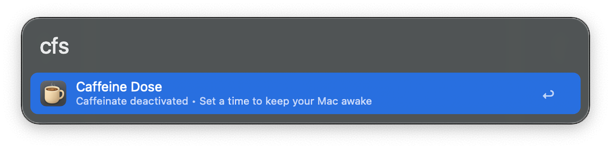
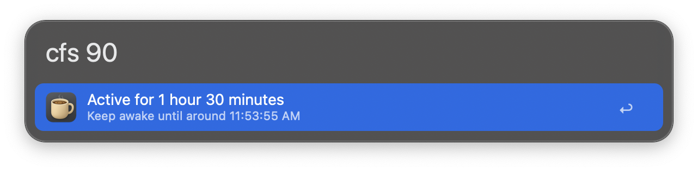

#  Caffeine Dose | Alfred Workflow

Keeps your Mac awake using the `caffeinate` command-line utility. No third-party or dedicated apps required. From Alfred you can start/stop sessions, set a duration or end time, and check the status.

## Download

- Available on the Alfred Gallery. [Get it here](https://alfred.app/workflows/vanstrouble/caffeine-dose/).
- Download it directly [from GitHub here](https://github.com/vanstrouble/caffeine-dose-alfred-workflow/releases/latest).

**Using Amphetamine? No worries — grab the workflow dose [here](https://github.com/vanstrouble/dose-alfred-workflow).**

## Usage

Start typing your action in Alfred using your configured keyword (default: `caff` or `cfs`, or your preferred trigger).

### Keep your Mac awake (`caff`)

Use the `caff` keyword to toggle caffeinate on or off, preventing macOS from sleeping.

- **Keyword:** `caff`

Hold the **Command (⌘)** key while using the `caff` command, the session will allow the display to sleep.

### All-in-one command (`cfs`)

The `cfs` command lets you keep your Mac awake for a specific duration or until a set time, all from Alfred. It also shows a clear status indicator so you always know if caffeinate is active.

**Key features:**
- Flexible input: set minutes, hours, or a specific time (e.g., `cfs 15`, `cfs 2h`, `cfs 9:30pm`).
- Natural language support for durations and times.
- Simple status display: see if caffeinate is active or inactive at a glance.

- **Keyword:** `cfs [duration or time]`

Hold **Command (⌘)** while using `cfs` to allow the display to sleep during the session.

#### Examples

| Command     | Description                                     |
|-------------|-------------------------------------------------|
| `cfs s`     | Shows status, time left, and if display can sleep. |
| `cfs d`     | Deactivates caffeinate. |
| `cfs i`     | Keeps your Mac awake indefinitely.              |
| `cfs 15`    | Keeps your Mac awake for 15 minutes.            |
| `cfs 2h`    | Keeps your Mac awake for 2 hours.               |
| `cfs 1 30`  | Keeps your Mac awake for 1 hour and 30 minutes. |
| `cfs 9:30`  | Keeps your Mac awake until the next 9:30.       |
| `cfs 8am`   | Keeps your Mac awake until 8:00 AM.             |
| `cfs 11:40pm`| Keeps your Mac awake until 11:40 PM.           |

The `cfs` command supports both 12-hour (AM/PM) and 24-hour time formats.

### Customization

**Keywords**

Both `caff` and `cfs` commands can be customized in the workflow settings. You can modify their keywords or behavior to better suit your needs.

**Time format**

Set to 12-hour (AM/PM) or 24-hour in the workflow settings. This changes how times are shown in notifications and status.

**Hotkeyss**

Set hotkeys for quick and direct actions, like toggling caffeinate or starting a session instantly.
