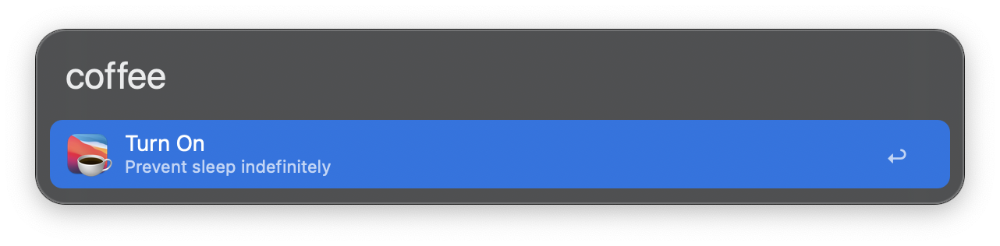
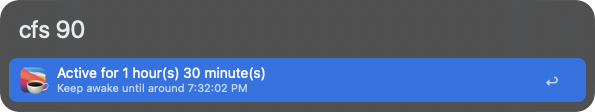

#  Caffeine Dose | Alfred Workflow

Keeps your Mac awake using the `caffeinate` command-line utility. From Alfred, you can start or stop sessions, set how long your Mac should stay up (or until when), and check the current status — all in a few keystrokes.

## Download

-   Get it on GitHub [here](https://github.com/vanstrouble/caffeine-dose-alfred-workflow/releases).

**Using Amphetamine? No worries — grab the workflow dose [here](https://github.com/vanstrouble/dose-alfred-workflow).**

## Usage

### Keep your Mac awake (coffee)

Use the `coffee` keyword to toggle caffeinate on or off, preventing macOS from sleeping.

- **Keyword:** `coffee`

Hold the **Command (⌘)** key while using the `coffee` command, the session will allow the display to sleep.

### One command for everything (cfs)

The `cfs` command allows you to set caffeinate to keep your Mac awake for a specific duration or until a specific time. It supports natural input formats for minutes, hours, and specific times, making it flexible and easy to use.

- **Keyword:** `cfs [duration or time]`

Hold the **Command (⌘)** key while using the `cfs` command, the session will allow the display to sleep.

#### Examples:

| Command     | Description                                     |
|-------------|-------------------------------------------------|
| `cfs i`     | Keeps your Mac awake indefinitely.              |
| `cfs s`     | Checks if caffeinate is active or the remaining time. |
| `cfs 15`    | Keeps your Mac awake for 15 minutes.            |
| `cfs 2h`    | Keeps your Mac awake for 2 hours.               |
| `cfs 1 30`  | Keeps your Mac awake for 1 hour and 30 minutes. |
| `cfs 9:30`  | Keeps your Mac awake until the next 9:30.       |
| `cfs 8am`   | Keeps your Mac awake until 8:00 AM.             |
| `cfs 11:40pm`| Keeps your Mac awake until 11:40 PM.           |

The `cfs` command supports both 12-hour (AM/PM) and 24-hour time formats.

### Customization
Both `coffee` and `cfs` commands can be customized in the workflow settings. You can modify their keywords or behavior to better suit your needs.
